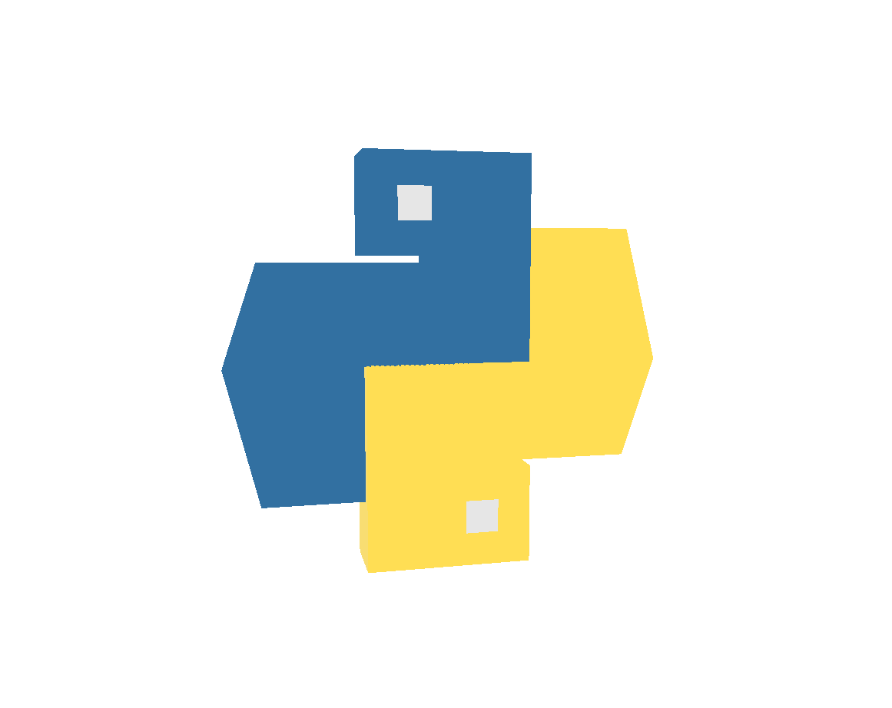

<h4 align="center">Hi 👋, I'm Kaan, An enthusiastic Robotics, Computer Vision, AI and Fullstack Developer & Reseacher</h4> 

<table>
<tr>
  <td>
    

  </td>
  <td>
    

    
    

  </td>
  <td>
    

  </td>
</tr>
</table>

#### Languages and Tools (have knowledge and experience)

##### Computer Vision, AI & Robotics  
  &nbsp;
  &nbsp;
  &nbsp;
   &nbsp;
   &nbsp;
  &nbsp;
  &nbsp;
  &nbsp;
  &nbsp;
   &nbsp;
  &nbsp;
   &nbsp;
  &nbsp;
   &nbsp;
   &nbsp;
   &nbsp;
   &nbsp;
   &nbsp;
   &nbsp;
  &nbsp;

##### Full-Stack & Mobile Development  
   &nbsp;
   &nbsp;
   &nbsp;
  
  
  
  
   &nbsp;
   &nbsp;
   &nbsp;
   &nbsp;
   &nbsp;
   &nbsp;
   &nbsp;
   &nbsp;
   &nbsp;
   &nbsp;
   &nbsp;
   &nbsp;
   &nbsp;
   &nbsp;
   &nbsp;
   &nbsp;
   &nbsp;
   &nbsp;
